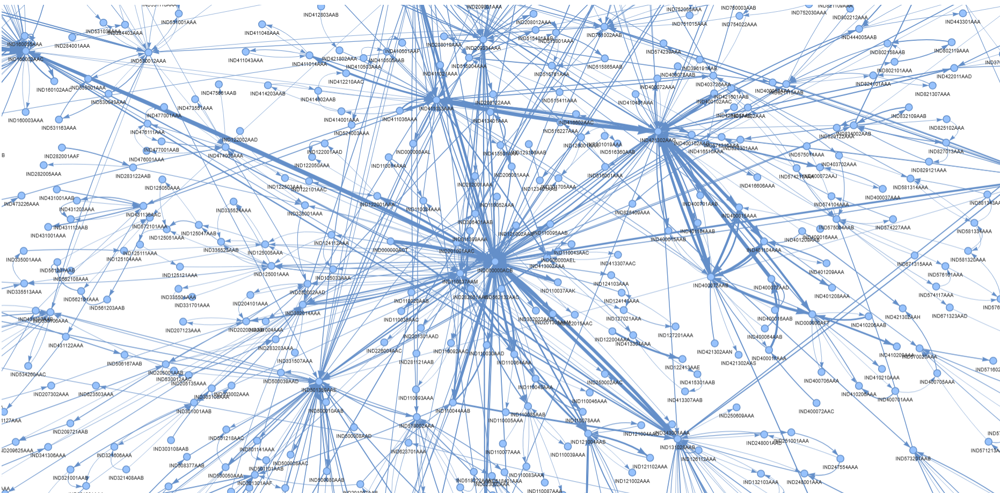

#  Delhivery Network Intelligence & Operations Strategy

## Summary
In Delhivery's high-stakes logistics network, a delayed shipment is a compounding operational cost. Traditional ETA models rely purely on tabular point-to-point data, rendering them blind to cascading network delays. 

This project treats the logistics infrastructure as a **living mathematical graph**. By fusing physical routing data with advanced spatial Artificial Intelligence (**Node2Vec & GraphSAGE**), we mapped structural chokepoints, predicted delays with network-aware accuracy, and delivered actionable, ROI-driven business interventions.

**Key Business Outcomes:**
* **Identified the Top 3 Bottlenecks:** Discovered that Gurgaon, Bhiwandi, and Bangalore hubs alone drive **26.5% of total national lateness** due to *dwell time*, not road traffic.
* **ETA Accuracy Leap:** Built a Graph-Enhanced Neural Network that reduced ETA error by **~25%** and doubled 15%-accuracy SLA compliance compared to tabular baselines.
* **Optimized FTL vs. Carting:** Developed a counterfactual inference engine to isolate 200+ specific corridors where upgrading to Full Truck Load (FTL) saves 2.5–4 hours, protecting profit margins.

---

## Live Interactive Dashboards
*(Click the links below to explore the network topology live in your browser)*

* 🔗 **[Delhivery Bottleneck Audit (Pro Layout)](https://crazyminds-123.github.io/delhivery-network-intelligence/visualisations/bottlenecks_pro.html)**
* 🔗 **[Full Network Traffic Visualization](https://crazyminds-123.github.io/delhivery-network-intelligence/visualisations/network.html)**

---

## Repository Navigation

| File / Directory | Description |
|---|---|
|  **[`reports/memo_IITG_project.pdf`](./reports/memo_IITG_project.pdf)** | **Start Here.** A 2-page executive summary detailing the root causes of delays and ROI-driven operational interventions. |
|  **[`notebooks/final_project_4.ipynb`](./notebooks/final_project_4.ipynb)** | The master Jupyter Notebook containing the end-to-end data pipeline, EDA, Graph Modeling, and ML Showdown. |
|  **[`visualisations/`](./visualisations/)** | The raw HTML files for the PyVis interactive network graphs. |
|  **[`data/`](./data/)** | Processed node metrics, audited corridors, and edge-lists (raw PII/massive logs omitted). |

---

##  Technical Architecture

1. **Data Engineering (The "Cumulative Trap"):** Safely collapsed 144k raw scanning segments into clean trip-legs, isolating physical driving time from hub dwell time.
2. **Graph Theory (NetworkX):** Constructed a directed, weighted graph modelling physical corridors. Calculated Betweenness Centrality, In/Out Degree, and Clustering to rank vulnerability.
3. **Spatial Embeddings (Node2Vec):** Generated 16-dimensional topological coordinates for every facility via simulated random walks to give ML models spatial awareness.
4. **Graph Neural Networks (PyTorch GraphSAGE):** Deployed a custom GraphSAGE architecture with negative sampling to mathematically aggregate downstream congestion states.
5. **Counterfactual Inference:** Cloned historical datasets to simulate alternate realities (Forced FTL vs. Forced Carting) to build a precise cost-benefit decision framework.

---
*Prepared by **Kapil Paroda, Pallav Pratibh and Sanchit Singla** | Indian Institute of Technology Kanpur (IITK)*
